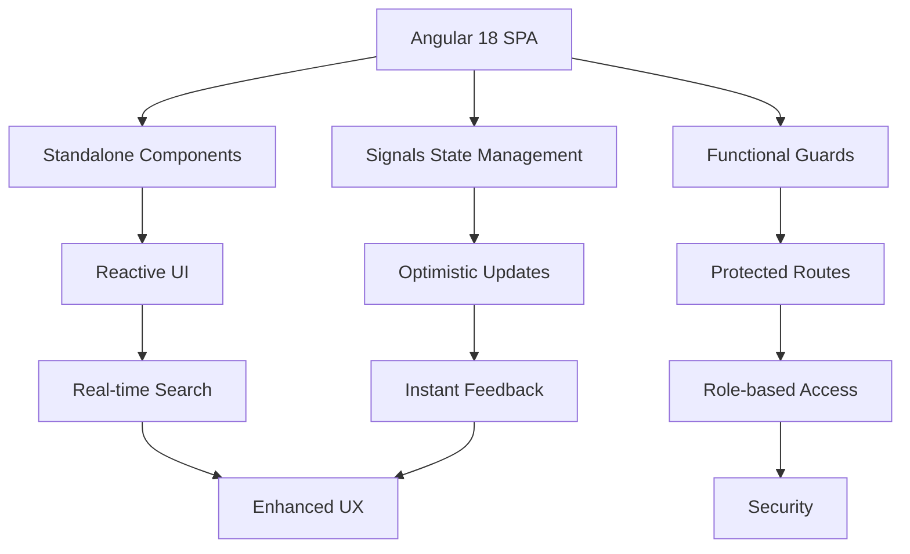

# 📚 Library Management Client

A modern, responsive Single Page Application (SPA) built with Angular 18 to interact with the Library Management API.

# 📚 Library Management System - Angular Client


A sophisticated, production-ready Single Page Application (SPA) built with Angular 18 for managing library operations. Featuring modern reactive patterns, seamless authentication, and an elegant admin dashboard.

## ✨ Live Demo
🔗 **[Try it here](https://your-library-client-demo.com)** | 📱 **Fully Responsive**

## 🏗️ Architecture Overview



## 🎯 Key Features

### 🔐 **Authentication & Security**
- **JWT Token Management** with automatic interceptor injection
- **Role-based Route Protection** (Admin/User)
- **Session persistence** with secure localStorage handling
- **Automatic token refresh** and error handling

### 📱 **User Experience**
- **Optimistic UI Updates** - Instant feedback for book operations
- **Global Error Handling** - User-friendly Toastr notifications
- **Server-side Pagination** - Efficient large dataset handling
- **Advanced Filtering** - Multi-criteria search & category filters
- **Responsive Design** - Mobile-first Bootstrap 5 implementation

### 👑 **Admin Dashboard**
- **Inventory Management** - Add/Edit/Remove books
- **Loan Oversight** - Real-time monitoring of active loans
- **Overdue Calculator** - Automated days overdue computation
- **One-Click Notifications** - Email reminders for overdue books
- **Analytics Overview** - Library usage statistics

### 📊 **Data Management**
- **Reactive State** with Angular Signals
- **HTTP Interceptors** for consistent API communication
- **Caching Strategies** for improved performance
- **Form Validation** with reactive forms

## 🛠️ Technology Stack

| Technology | Purpose | Version |
|------------|---------|---------|
| **Angular** | Core Framework | 18.x |
| **TypeScript** | Type Safety | 5.x |
| **Bootstrap 5** | UI Components & Layout | 5.3.x |
| **RxJS** | Reactive Programming | 7.x |
| **ngx-bootstrap** | Enhanced Components | 10.x |
| **ngx-toastr** | Notifications | 17.x |
| **FontAwesome** | Icons | 6.x |


## 📁 Project Structure

```
src/
├── app/
│   ├── core/                 # Singleton services, interceptors
│   │   ├── interceptors/
│   │   ├── guards/
│   │   └── services/
│   ├── features/            # Feature modules
│   │   ├── auth/
│   │   ├── books/
│   │   ├── loans/
│   │   └── admin/
│   ├── shared/              # Shared components, pipes, directives
│   ├── layouts/             # App layouts
│   └── app.config.ts        # App configuration
├── assets/                  # Static assets
├── environments/            # Environment configurations
└── styles/                  # Global styles
```

## 🚀 Getting Started

### 📋 Prerequisites
- ⚙️ **Node.js** (LTS version)
- 📦 **Angular CLI**

### ⚡️ Installation
1. 📥 Clone the repository:
```bash
git clone https://github.com/MahmoodElbadri/librarysystemclient.git
```

2. 📂 Navigate to the project directory:
```bash
cd Library.Client
```

3. 📦 Install dependencies:
```bash
npm install
```

4. ▶️ Run the development server:
```bash
ng serve
```

5. 🌐 Open http://localhost:4200 in your browser.


⭐ **Star this repo if you found it useful!** 🔨 Built by Mahmood Elbadri with ❤️
